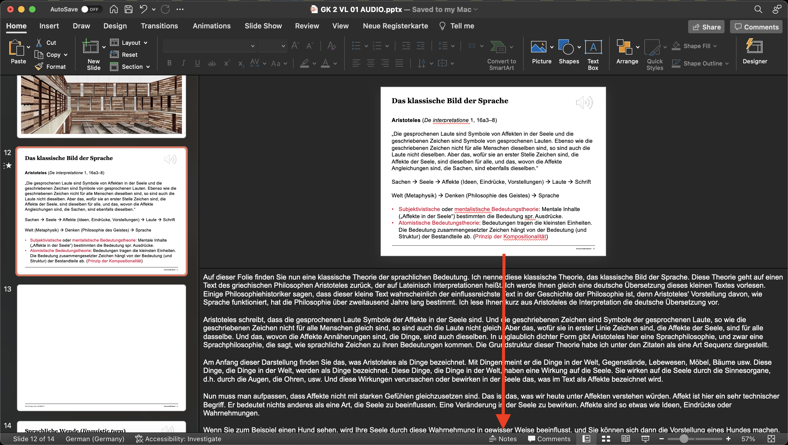

## GK Sprachphilosophie PowerPoint Transkripte

Dieses Repository enthält die Transkriptionen der PowerPoint-Präsentationen von Prof. Markus Wild,
die im Rahmen des Moduls Sprachphilosophie im Herbstsemester 2022 gehalten wurden. 

Die Transkription wurde mit [AssemblyAI](https://www.assemblyai.com) durchgeführt. 
Da der Text von einem Sprachmodell verarbeitet wurde, stimmen die Transkriptionen zum Teil nicht mit dem Gesprochenen überein.
Ausserdem wurde bei jedem sechsten Satz ein neuer Absatz eingefügt, um die Lesbarkeit zu verbessern.

### Transkripte

In diesem [Google Drive Ordner](https://drive.google.com/drive/folders/1bCUJR_EMPyfwJNEGyCe91D4mwbNaQ1YA?usp=share_link) 
befinden sich alle transkribierten Powerpoints der Vorlesung. 
Die Transkripte sind in den Powerpoints für die Folien enthalten, die Audiodateien enthalten. 
Für diese Folien ist der Text im Textfeld "Notizen" zu finden (Siehe Bild unten). 

Ausserdem ist in der [transcript.pdf Datei](Transcript/transcript.pdf) der gesamte transkribierte Text der Vorlesung enthalten.

### Programm
Das Programm, das ich geschrieben habe, um die Transkriptionen zu erstellen, findet man in der Datei [main.py](main.py).

### Unterstützung
Da die Verwendung von AssemblyAI mit Kosten verbunden ist, würde ich mich über eine Spende freuen.
